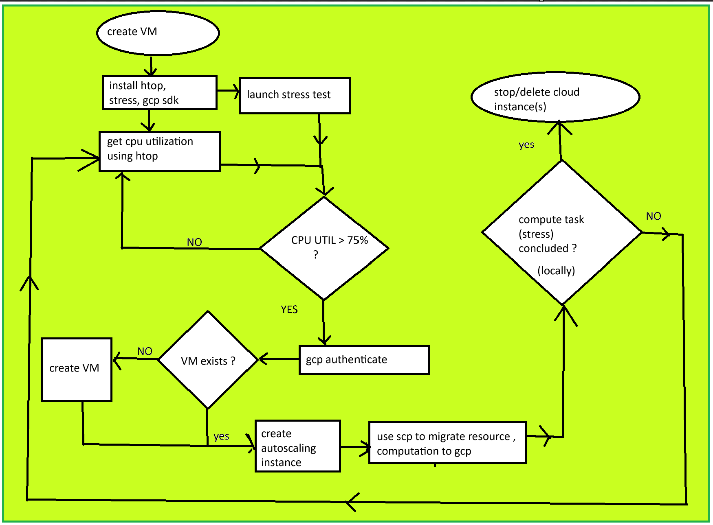
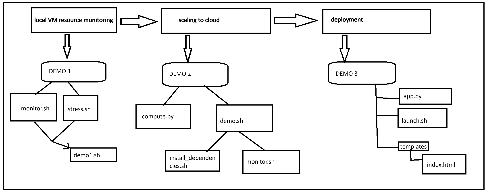

# **VM to Cloud Autoscaler 🚀**
*A Flask-based web app that monitors CPU usage and auto-migrates to GCP when utilization exceeds 75%.*



## **📌 Overview**
This project demonstrates:
✅ **Monitoring CPU Usage** on a **local VM**  
✅ **Auto-migrating** a workload to **GCP when CPU > 75%**  
✅ **Running a compute-intensive task** to simulate high CPU usage  
✅ **Scaling a Flask web app from VM → GCP automatically**  

---

## **📌 Project Structure**
```
vm-to-cloud-autoscaler/
│— demo1.sh         # Runs CPU monitoring script locally with stress test
│— demo2/           # Auto-migrates compute task to GCP when CPU exceeds 75%
│   ├─ compute.py   # CPU-intensive Python script
│   └─ demo2.sh     # Shell script to run auto-scaling logic
│— demo3_autoscale_flask_app/  # Full Flask-based web app auto-migrating to GCP
│   ├─ templates/   # Contains index.html for UI
│   ├─ app.py       # Flask backend with CPU monitoring & migration logic
│   └─ launch.sh    # Automates setup & migration to GCP
│— LICENSE
│— README.md
```

---

# **📌 Step-by-Step Instructions**
### **🛠️ Step 1: Setup Local VM**
1. **Install VirtualBox** → [Download here](https://www.virtualbox.org/wiki/Downloads)
2. **Create an Ubuntu VM** in VirtualBox:
   - Memory: `8506 MB`
   - CPUs: `4`
   - Disk: `25GB`
3. **Power up & install Ubuntu 24.04.1**

---

## **📌 Running the Demos**
### **🚀 Demo 1: CPU Monitoring with Stress Test**
**Goal:** Runs a CPU monitoring script that detects high usage.

1. **Install required tools:**
   ```bash
   sudo apt update && sudo apt install -y htop bc stress
   ```
2. **Run the script:**
   ```bash
   chmod +x demo1.sh
   ./demo1.sh
   ```
3. **Manually trigger high CPU usage:**
   ```bash
   stress --cpu 4 --timeout 300s
   ```
✅ **If CPU usage exceeds 75%,** the script detects it and prints a warning.

---

### **🚀 Demo 2: Auto-Migrating Compute Task to GCP**
**Goal:** Detects high CPU usage and migrates computation to GCP.

1. **Install GCP SDK on VM:**
   ```bash
   sudo apt update && sudo apt install -y google-cloud-cli
   gcloud auth login
   gcloud config set project YOUR_PROJECT_ID
   gcloud config set compute/zone YOUR_COMPUTE_ZONE
   ```
2. **Run the auto-scaling script:**
   ```bash
   cd demo2
   chmod +x demo2.sh
   ./demo2.sh
   ```
3. **When CPU > 75%:**
   - **GCP VM is created (if not existing)**
   - **`compute.py` is transferred & executed on GCP**

✅ **Check execution on GCP:**
```bash
gcloud compute instances list
```

---

### **🚀 Demo 3: Flask Web App Auto-Migrating to GCP**
**Goal:** A Flask web app that monitors CPU usage & migrates when overloaded.

1. **Install dependencies:**
   ```bash
   sudo apt update && sudo apt install -y python3-flask python3-psutil python3-pip google-cloud-cli
   pip install flask psutil paramiko --break-system-packages
   ```
2. **Run the Flask web app locally:**
   ```bash
   cd demo3_autoscale_flask_app
   python3 app.py
   ```
3. **Access the web app:**
   ```
   http://localhost:5000
   ```
4. **Click “Start Computation”** to overload CPU.  
5. **If CPU > 75%, the app automatically migrates to GCP!**

✅ **Find new app URL on GCP:**
```bash
gcloud compute instances list
```
Visit:
```
http://<GCP-VM-IP>:5000
```
*(Replace `<GCP-VM-IP>` with your actual GCP VM's external IP.)*

---

## **📌 How It Works**
### **🔹 Auto-Migration Logic**
1. **Continuously monitors CPU usage.**
2. **If CPU > 75%,** it:
   - Creates a **new GCP instance** if not available.
   - **Transfers files (Flask app, compute.py) to GCP**.
   - **Executes `compute.py` or Flask app on GCP**.
3. **Stops running locally & shifts workload to GCP.**

---

## **📌 Technologies Used**
- **Python (Flask, psutil, numpy)**
- **Google Cloud Compute Engine**
- **Shell Scripting (Bash, SCP, SSH)**
- **Paramiko (for secure file transfer)**
- **Chart.js (Frontend visualization)**

---

## **📌 Future Enhancements**
🚀 **Add domain mapping (`flask-app.yourdomain.com`)**  
📩 **Send email/Slack alerts on migration**  
📊 **Monitor GCP resource utilization & optimize scaling**  

---

## **📌 Contributors**
👨‍💻 **Rishabh Johri** - Initial Development  
🔹 Contributions are welcome via pull requests! 🚀  

---

## **📌 License**
This project is licensed under the **MIT License**.

---

### **🎯 Ready to Run?**
1. **Clone the repo:**
   ```bash
   git clone https://github.com/rishabhjohri/vm-to-cloud-autoscaler.git
   cd vm-to-cloud-autoscaler
   ```
2. **Follow the Demo Steps!** 🚀


